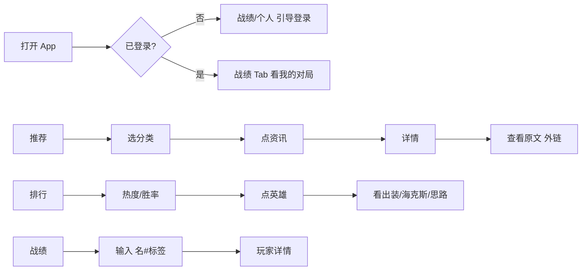

# LoL 大乱斗资讯 App — 产品设计文档

> 版本：V1.0 · 原型阶段 · 2026-07-07

## 1. 产品概述

| 项 | 说明 |
|----|------|
| 产品名 | LoL 大乱斗资讯（暂定） |
| 定位 | 面向英雄联盟国服玩家的 **大乱斗（ARAM）** 资讯与数据工具 App |
| 目标用户 | LoL 玩家，主要关注极地大乱斗模式 |
| 平台 | 手机 App（Expo / iOS + Android） |
| 区服 | 国服 only |
| 数据阶段 | V1 假数据原型，后续对接自建 CMS + 后端 API |

### 1.1 核心价值

- **推荐**：浏览 LoL / 大乱斗相关资讯（图文 + 视频）
- **排行**：查看英雄热度 / 胜率，进入详情获取出装、海克斯符文优先级、加点与思路
- **战绩**：搜索玩家（名字#标签），登录后绑定 ID 查看自己的对局
- **个人**：站内账号注册登录，绑定召唤师 ID

---

## 2. 功能范围

### 2.1 V1 包含

| 模块 | 功能 |
|------|------|
| 推荐 | 3 分类 Tab（综合 / 攻略 / 赛事）+ 资讯列表 + 详情页跳外链 |
| 排行 | 英雄热度 / 胜率切换，大乱斗国服固定场景 |
| 英雄详情 | 推荐出装、海克斯符文 S/A/B 优先级、技能加点、操作思路 |
| 战绩 | 搜索玩家、登录绑定 ID、我的对局、玩家详情 |
| 个人 | 登录 / 注册、绑定 ID、退出 |
| 全局 | 顶栏标题 + 左侧菜单（设置、关于） |

### 2.2 V1 明确不做

- 对局详情页、伤害图表
- 符文 / 出装独立排行
- 段位 / 位置 / 模式筛选（固定大乱斗）
- 收藏、评论、推送
- 第三方登录（微信 / QQ）
- 多区服、多游戏扩展

---

## 3. 信息架构

```
App
├── (tabs) 底部四 Tab
│   ├── 推荐 index
│   ├── 排行 rank
│   ├── 战绩 record
│   └── 个人 profile
├── 资讯详情 news/[id]
├── 英雄详情 hero/[id]
├── 玩家详情 player/[id]
├── 登录 login
└── 注册 register
```

### 3.1 页面清单

| # | 页面 | 路由建议 | 类型 |
|---|------|----------|------|
| 1 | 推荐 | `(tabs)/index` | Tab 主页 |
| 2 | 资讯详情 | `news/[id]` | Stack |
| 3 | 排行 | `(tabs)/rank` | Tab 主页 |
| 4 | 英雄详情 | `hero/[id]` | Stack |
| 5 | 战绩 | `(tabs)/record` | Tab 主页 |
| 6 | 玩家详情 | `player/[id]` | Stack |
| 7 | 个人 | `(tabs)/profile` | Tab 主页 |
| 8 | 登录 | `login` | Stack |
| 9 | 注册 | `register` | Stack |

对局信息以 **列表条目** 展示，不设独立详情页。

---

## 4. 全局布局

```
┌─────────────────────────────────┐
│ [≡]      页面标题          [ ] │  ← 顶栏 44~48pt
├─────────────────────────────────┤
│         页面内容区               │
├─────────────────────────────────┤
│  推荐  │  排行  │  战绩  │  个人 │
└─────────────────────────────────┘
```

| 区域 | 规则 |
|------|------|
| 顶栏左 | `≡` 侧滑菜单：设置、关于、版本号 |
| 顶栏中 | 当前 Tab 名称 |
| 顶栏右 | V1 留空 |
| Stack 子页 | 左返回，无底部 Tab |

---

## 5. 视觉规范

| 项 | 值 |
|----|-----|
| 主题 | 深色优先 |
| 背景色 | `#0F1419` |
| 卡片色 | `#1A2332` |
| 主色（金） | `#C8AA6E` — 按钮、选中态 |
| 辅色（青） | `#0397AB` — 链接、标签 |
| 正文 | `#E8E6E3` |
| 次要文字 | `#8B9BB4` |
| 胜率涨 | `#4ADE80` |
| 胜率跌 | `#F87171` |
| 圆角 | 卡片 12px，按钮 8px |

**气质**：工具向 + 轻资讯，信息密度适中，无复杂动效。

---

## 6. 页面规格

### 6.1 推荐 Tab

**顶部分类 Tab**：综合 | 攻略 | 赛事（名称可由 CMS 配置）

**列表卡片字段**：

- 封面图
- 标题
- 来源 + 发布时间
- 类型角标：图文 / 视频

**交互**：点击卡片 → 资讯详情 → 「查看原文」跳转系统浏览器外链。

### 6.2 资讯详情

- 大图封面
- 标题、来源、日期、类型
- CMS 摘要（2~4 行）
- 底部按钮「查看原文 ↗」

### 6.3 排行 Tab

- 分段控件：**热度** | **胜率**（二选一）
- 固定文案：大乱斗 · 国服
- 列表项：排名、英雄头像、名称、登场率或胜率

**交互**：点击英雄 → 英雄详情

### 6.4 英雄详情

| 区块 | 内容 |
|------|------|
| 头部 | 大头像、英雄名、大乱斗 · 国服 |
| 推荐出装 | 6 装备槽 + 核心出装说明 |
| 海克斯符文优先级 | S / A / B 三档（非召唤师符文） |
| 技能加点 | 如 Q → W → E，6 级 R |
| 操作思路 | 纯文本 |

区块默认全部展开。

### 6.5 战绩 Tab

**始终显示**：搜索框（召唤师名#标签 + 搜索按钮）

**已登录且已绑定 ID**：

- 显示绑定 ID + 换绑
- 「最近对局」列表

**未登录**：

- 搜索仍可用
- 提示「登录后绑定 ID 查看我的对局」+ 去登录按钮

**对局条目**：英雄头像、胜负、KDA、时间、时长（不可点击进入详情）

**交互**：搜索 → 玩家详情

### 6.6 玩家详情

- 召唤师 ID（名字#标签）
- 段位、大乱斗、胜率
- 常用英雄（头像 + 场次）
- 最近 N 场对局列表

### 6.7 个人 Tab

**未登录**：登录 / 注册按钮

**已登录**：

- 用户名
- 绑定 ID + 修改
- 退出登录

### 6.8 登录 / 注册

- 用户名 + 密码（注册含确认密码）
- 无验证码、无第三方登录

**测试账号（原型）**：

- 登录：`demo` / `123456`
- 绑定 ID：`DemoPlayer#CN1`

---

## 7. 用户流程



---

## 8. 数据模型（原型假数据）

### 8.1 资讯 News

```ts
interface News {
  id: string;
  category: 'general' | 'guide' | 'esports';
  title: string;
  cover: string;
  source: string;
  publishedAt: string;
  type: 'article' | 'video';
  summary: string;
  externalUrl: string;
}
```

### 8.2 英雄 Hero

```ts
interface Hero {
  id: string;
  name: string;
  avatar: string;
  pickRate: number;   // 登场率
  winRate: number;    // 胜率
  build: string[];    // 6 装备 ID
  buildNote: string;
  hextech: { tier: 'S' | 'A' | 'B'; names: string[] }[];
  skillOrder: string;
  tips: string;
}
```

### 8.3 玩家 Player

```ts
interface Player {
  riotId: string;     // 名字#标签
  tier: string;
  winRate: number;
  topChampions: { heroId: string; games: number }[];
  recentMatches: Match[];
}
```

### 8.4 对局 Match

```ts
interface Match {
  id: string;
  heroId: string;
  win: boolean;
  kda: string;        // "12/3/8"
  playedAt: string;
  duration: string;     // "28:34"
}
```

### 8.5 假数据量

| 模块 | 数量 |
|------|------|
| 资讯 | 每分类 5 条 |
| 英雄排行 | 20 个 |
| 玩家 | 2 套固定模板 |
| 对局 | 每人 10 场 |

---

## 9. 原型图

### 查看方式

在浏览器中打开 **`docs/prototypes/index.html`**，可预览全部 7 个页面的交互原型（深色主题、375×812 手机框）。

如需 PNG：在浏览器中对单个手机框截图，或使用 DevTools 设备模式导出。

### 页面索引

| 编号 | 页面 | 说明 |
|------|------|------|
| 01 | 推荐 Tab | 分类 Tab + 资讯卡片流 |
| 02 | 资讯详情 | 摘要 + 查看原文按钮 |
| 03 | 排行 Tab | 热度/胜率 + 英雄列表 |
| 04 | 英雄详情 | 出装、海克斯、加点、思路 |
| 05 | 战绩 Tab | 搜索 + 绑定 ID + 对局 |
| 06 | 玩家详情 | 段位、常用英雄、对局 |
| 07 | 个人 Tab | 账号、绑定 ID、退出 |

---

## 10. 后续开发顺序建议

1. 全局顶栏 + 四 Tab 骨架
2. 假数据层 + 各列表页
3. Stack 详情页（资讯 / 英雄 / 玩家）
4. 登录注册 + 本地登录态
5. 外链跳转（`Linking.openURL`）
6. 对接 CMS / API（V2）
